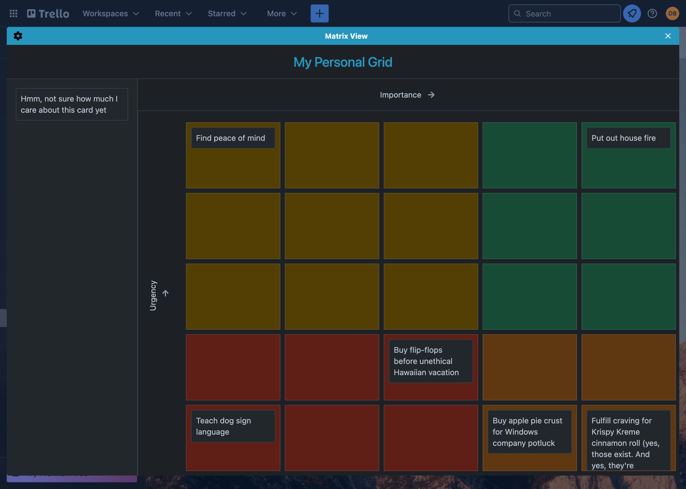
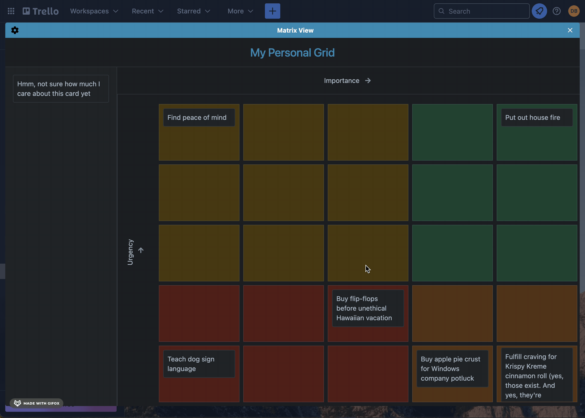
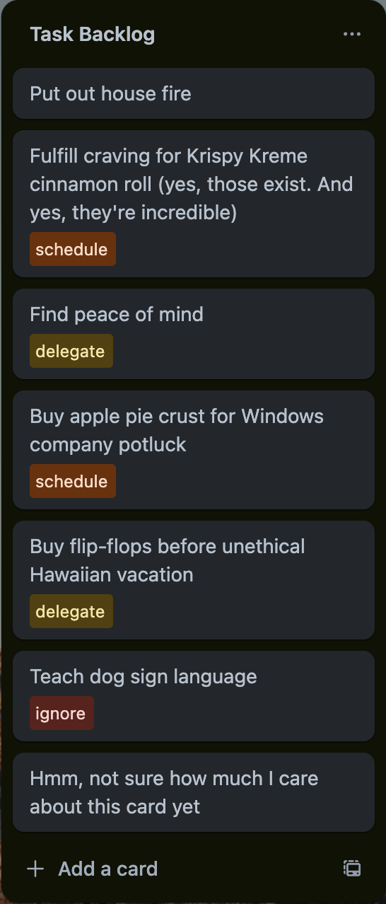
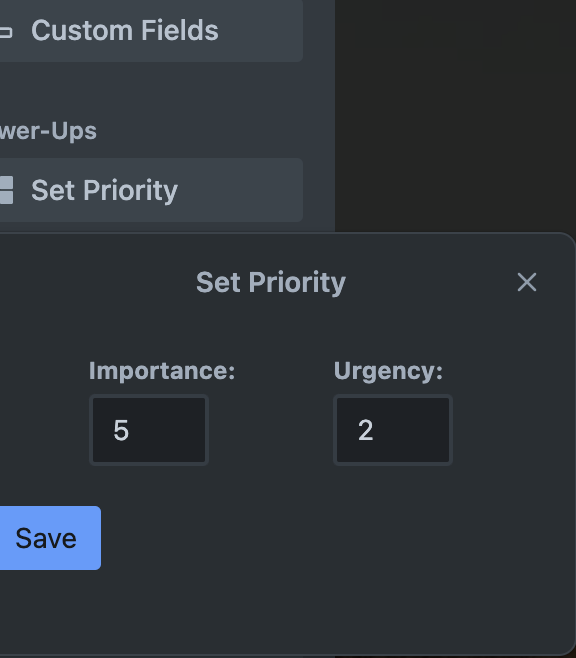
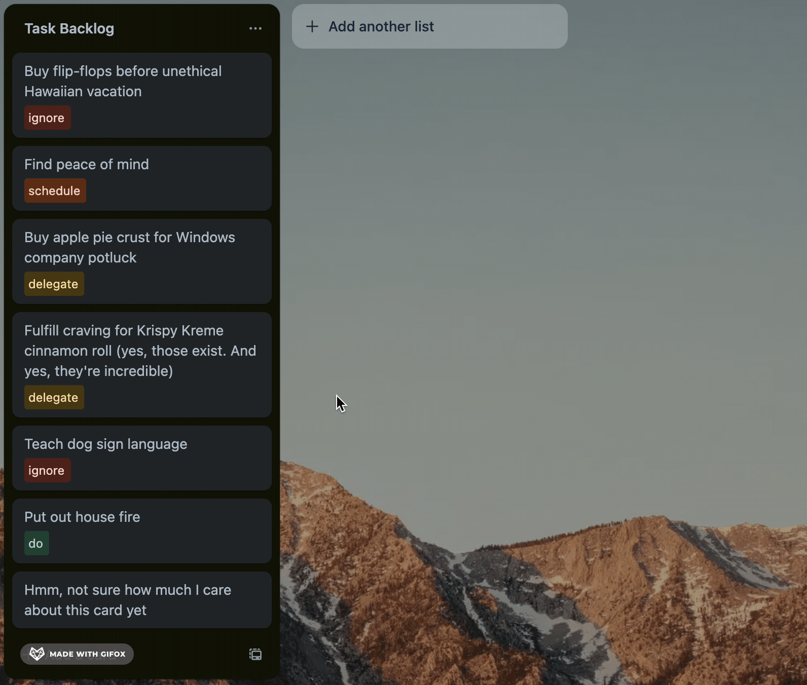

# Eisenhower Matrix

"I have two kinds of problems, the urgent and the important. The urgent are not important, and the important are never urgent." -Dwight D. Eisenhower

_INSERT_TRELLO_DOWNLOAD_LINK_

---

## About

Inspired by the wisdom of Dwight Esienhower, this Trello Power-Up allows you to prioritze, organize, and visualize your cards across two metrics: Importance, and Urgency.

The main interface is a modal containing the matrix itself which can be accessed by a board button. Here, cards can be dragged from the Unplaced Cards section onto any of the grid cells. This will assign the card with corresponding values for both Importance and Urgency. Cards can be dragged between grid cells, and even placed back into the Unplaced Cards section.

Going back to the Trello Board, each card is given a badge corresponding with its placement in the grid. The color and text will correspond with the quadrant in which the card resides.

Cards' Urgency & Importance values can also be adjusted by accessing the Set Priority card button. This method of setting the values allows the user to focus on how important or urgent a task truly is without being distracted by the tempting green cells of the 'do' quadrant.

Finally, the cards can be sorted according to their Importance & Urgency values, allowing the user to know exactly which task needs to be done next while looking at their board. This allows for a set it and forget it mentality with the grid, so the user doesn't need to keep returning to the grid just to understand how their tasks priority's stack up against one another.

## Customizability

Prioritization and time management are often incredibly specfic to each person. To maximize the amount of people for which this Power-Up can be useful, I have allowed for almost every aspect to be customizable.
- The direction in which each value increases along the grid can be swapped by pressing the corresponding arrow.
- The titles of both Importance & Urgency are accessible inn the Settings or directly editable on the Matrix View page.
- The colors of the quadrants can be adjusted (custom colors unfortunately will not appear on the card badges).
- The quadrant titles can be changed to 
- Card badges can be toggled on/off in their entirety.
- The grid size can also be adjusted to a maximum of 10 rows and 10 columns.